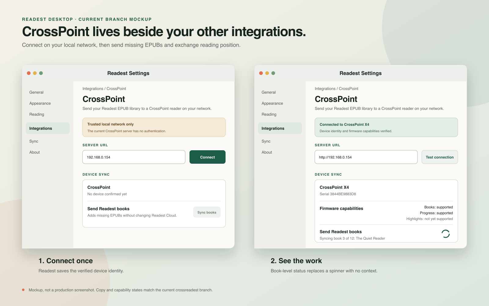

<div align="center">
  
  <h1>Readest for CrossPoint</h1>
  <p>A desktop Readest fork that sends EPUBs to CrossPoint and keeps reading position moving between them.</p>
</div>

<div align="center">

[](#what-is-new)
[](https://github.com/kat3samsin/readest/tree/crossreadest)
[](#current-status)
[](LICENSE)

</div>

This branch adds a dedicated CrossPoint integration to [Readest](https://github.com/readest/readest). It connects directly to the reader on your local network, sends missing EPUBs, and exchanges a stable reading position without enrolling the device as a Readest Cloud replica.

Use it with the matching [`crossreadest` CrossPoint firmware](https://github.com/kat3samsin/crosspoint-reader/tree/crossreadest).

[What is new](#what-is-new) · [Mockup](#mockup) · [Current status](#current-status) · [Connect a reader](#connect-a-reader) · [Build](#build-the-desktop-app) · [Upstream Readest](#upstream-readest)

## What is new

### CrossPoint under Integrations

The desktop settings app has a dedicated **Settings → Integrations → CrossPoint** page. Enter the reader's address, test the connection, and keep the verified device identity with the local Readest settings.

The connection check reads the firmware capability response before a sync starts. A changed device, unsupported build, or unreachable address gets a specific error instead of a generic failed transfer.

### Missing-book transfer

- Sends active EPUBs from the Readest library to the root of the CrossPoint SD card.
- Downloads a Readest Cloud book locally first when the desktop library does not have its bytes yet.
- Streams native desktop files instead of loading a whole EPUB into JavaScript memory.
- Uploads books sequentially, verifies their size, and records each step in the device manifest.
- Adopts an identical EPUB already on the reader, avoiding a second copy on first sync.
- Resumes an interrupted manifest entry when the completed file is already present.
- Leaves unmanaged files on the reader alone.

The sync does not change Readest Cloud or register CrossPoint as a normal cloud file provider.

### Reading-position exchange

- Reads and writes versioned progress sidecars under `/.crosspoint/readest-sync/`.
- Uses the EPUB's stable document identity instead of its filename.
- Resolves positions against the matching EPUB, so font size and pagination changes do not turn a page number into the source of truth.
- Stages a position received from CrossPoint until the matching EPUB opens in desktop Readest.
- Keeps separate Readest-owned and CrossPoint-owned state, with atomic replacement on the firmware side.

### Progress you can actually see

While sending a library, the integration reports:

```text
Preparing CrossPoint sync…
Syncing book 3 of 12: The Quiet Reader
```

The final notice distinguishes success, partial book transfer, progress conflicts, unavailable local files, and device changes.

## Mockup



This is a UI mockup based on the current `crossreadest` branch. Its labels, capability states, and progress copy match the implementation.

## Current status

| Capability | State |
| --- | --- |
| Connect by local IP address | Shipped |
| Verify device identity and firmware capabilities | Shipped |
| Send missing EPUBs | Shipped |
| Adopt matching files already on CrossPoint | Shipped |
| Resume interrupted book transfer | Shipped |
| Show current book during library sync | Shipped |
| CrossPoint → Readest reading position | Shipped |
| Readest → CrossPoint reading position | Shipped |
| Bookmarks and highlights | Design only |
| Mobile and web CrossPoint bridge | Not supported |

CrossPoint can create and display its own persistent highlights. Moving those ranges between the two apps is a separate protocol. The firmware continues to advertise `highlights: false` until that round trip is implemented and tested on hardware.

See [the staged annotation sync contract](./docs/READEST_ANNOTATION_SYNC.md) for that work.

## Connect a reader

### Before you start

- Install the matching custom CrossPoint firmware.
- Use the Readest desktop app from this branch.
- Put the computer and reader on the same trusted Wi-Fi network.
- Test with one EPUB before sending a large library.

### Pair and sync

1. On CrossPoint, open **File Transfer → Join Network**.
2. Note the IP address shown on the reader.
3. In Readest desktop, open **Settings → Integrations → CrossPoint**.
4. Enter the IP address. A bare address such as `192.168.0.154` is accepted.
5. Select **Connect**.
6. Confirm that Books and Progress show as supported.
7. Select **Sync books**.
8. Open the matching EPUB when you want a staged reading position applied.

The current CrossPoint WebDAV server is unauthenticated. Keep this setup on a trusted local network.

## How the bridge is separated

Three pieces are related, but they do different jobs:

| Piece | Job |
| --- | --- |
| Readest Cloud | Syncs Readest apps and account data |
| CrossPoint WebDAV | Carries EPUB files and bridge sidecars over the local network |
| CrossPoint progress protocol | Chooses and applies a stable reading position for one matching EPUB |

Book transfer finishing does not prove that a newly received position has rendered. Desktop Readest applies a staged CrossPoint position when the matching book opens. CrossPoint applies a Readest position only after it resolves and renders the matching location.

## Failure boundaries

The bridge is intentionally conservative:

- A saved serial mismatch stops the run and asks for an explicit reconnect.
- A malformed manifest stops transfer instead of guessing ownership.
- Readest-managed paths are recorded in `/.crosspoint/readest-library.json`.
- Existing unmanaged EPUBs are preserved.
- An upload becomes active only after its remote size matches the local source.
- Concurrent sync button presses share one active run.
- Highlight support stays off until the complete annotation contract ships.

## Build the desktop app

### Prerequisites

- Node.js 22
- pnpm 11.1.1 through Corepack
- Rust and the platform dependencies required by Tauri 2

```bash
git clone https://github.com/kat3samsin/readest.git
cd readest
git checkout crossreadest
corepack enable
pnpm install
pnpm tauri build
```

For a development window:

```bash
pnpm tauri dev
```

Readest's platform setup and signing requirements remain in [CONTRIBUTING.md](./CONTRIBUTING.md).

## Verify the CrossPoint work

Run the focused component and service tests:

```bash
pnpm --filter @readest/readest-app test --run \
  src/__tests__/components/settings/CrossPointForm.test.tsx \
  src/__tests__/services/sync/devices/crosspoint
```

Then run the normal static checks:

```bash
pnpm lint
pnpm format:check
```

## Upstream Readest

This fork retains the full Readest application, including:

- EPUB, MOBI, KF8/AZW3, FB2, CBZ, TXT, and PDF reading
- Paginated and scrolling layouts
- Readest Cloud sync
- Highlights, notes, bookmarks, dictionary, Wikipedia, and translation
- OPDS and Calibre integration
- Text to speech and parallel reading
- macOS, Windows, Linux, iOS, Android, web, and PWA targets

The CrossPoint bridge itself is desktop-only because it uses native file streaming and a direct local-network connection.

For official releases, mobile apps, documentation, and community support, visit:

- [readest.com](https://readest.com)
- [readest/readest](https://github.com/readest/readest)
- [Readest documentation](https://readest.com/docs)

## Credits and license

Readest for CrossPoint is a fork of [Readest](https://github.com/readest/readest), which is a modern rewrite of [Foliate](https://github.com/johnfactotum/foliate). The reader, library, sync foundation, accessibility work, translations, and platform support belong to the upstream contributors.

Readest is free software under the [GNU Affero General Public License v3](./LICENSE).
